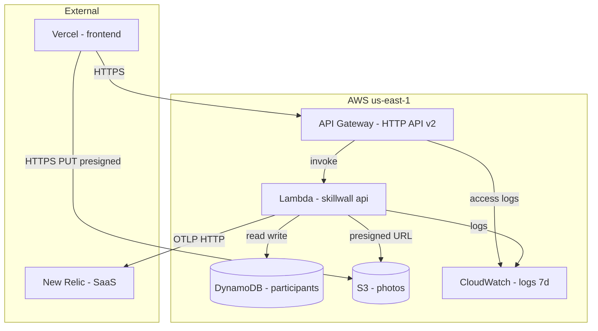

# Deployment Architecture — Unit: infra

## Architecture Diagram



## Terraform Outputs (dev environment)

| Output | Value |
|---|---|
| `api_gateway_id` | `h8slk7uopl` |
| `api_gateway_url` | `https://h8slk7uopl.execute-api.us-east-1.amazonaws.com/` |
| `dynamodb_table_name` | `skillwall-dev-participants` |
| `dynamodb_table_arn` | `arn:aws:dynamodb:us-east-1:278891234054:table/skillwall-dev-participants` |
| `lambda_function_name` | `skillwall-dev-api` |
| `lambda_function_arn` | `arn:aws:lambda:us-east-1:278891234054:function:skillwall-dev-api` |
| `s3_bucket_name` | `skillwall-dev-photos-278891234054` |
| `s3_bucket_arn` | `arn:aws:s3:::skillwall-dev-photos-278891234054` |

## Terraform State Management
- Backend: local (acceptable for demo)
- State file: `terraform.tfstate` (gitignored)
- For team use: consider S3 backend with DynamoDB locking

## Deployment Workflow
```
1. terraform init
2. terraform plan -var-file={env}.tfvars
3. terraform apply -var-file={env}.tfvars
4. Note outputs: api_gateway_url, lambda_function_name, s3_bucket_name, dynamodb_table_name
5. Deploy Lambda code: cd ../backend && ./scripts/deploy.sh
6. Deploy frontend: cd ../frontend && vercel deploy (with NEXT_PUBLIC_API_URL from step 4)
```

## Environment Configurations

| Variable | dev | demo | prod |
|---|---|---|---|
| environment | dev | demo | prod |
| cors_origin | http://localhost:3000 | https://skillwall-demo.vercel.app | https://skillwall.vercel.app |
| lambda_memory | 256 | 256 | 256 |
| lambda_timeout | 30 | 30 | 30 |
| log_retention_days | 7 | 7 | 30 |
| admin_token | (local secret) | (demo secret) | (prod secret) |
| new_relic_license_key | (dev key) | (demo key) | (prod key) |
| session_code | LATAM2026 | LATAM2026 | (configurable) |
