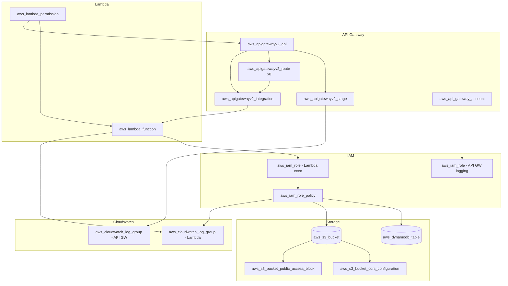

# Infrastructure Design — Unit: infra

## Terraform Resource Diagram



## AWS Service Mapping

| Logical Component | AWS Service | Terraform Resource |
|---|---|---|
| HTTP API | API Gateway HTTP API v2 | `aws_apigatewayv2_api` |
| API Stage | API Gateway Stage | `aws_apigatewayv2_stage` |
| API Routes (x8) | API Gateway Route | `aws_apigatewayv2_route` |
| API-Lambda Integration | API Gateway Integration | `aws_apigatewayv2_integration` |
| Compute | Lambda Function | `aws_lambda_function` |
| Lambda Permission | Lambda Permission | `aws_lambda_permission` |
| Lambda Execution Role | IAM Role | `aws_iam_role` |
| Lambda Policy | IAM Role Policy | `aws_iam_role_policy` |
| Database | DynamoDB Table | `aws_dynamodb_table` |
| Photo Storage | S3 Bucket | `aws_s3_bucket` |
| S3 CORS | S3 CORS Config | `aws_s3_bucket_cors_configuration` |
| S3 Public Access Block | S3 Public Access Block | `aws_s3_bucket_public_access_block` |
| Lambda Logs | CloudWatch Log Group | `aws_cloudwatch_log_group` |
| API Access Logs | CloudWatch Log Group | `aws_cloudwatch_log_group` |
| API Logging Role | IAM Role | `aws_iam_role` (for API GW → CW) |
| API Account Config | API Gateway Account | `aws_api_gateway_account` |

## Resource Configurations

### API Gateway HTTP API
```hcl
resource "aws_apigatewayv2_api" "api" {
  name          = "skillwall-${var.environment}-api"
  protocol_type = "HTTP"
  cors_configuration {
    allow_origins = [var.cors_origin]
    allow_methods = ["GET", "POST", "DELETE", "OPTIONS"]
    allow_headers = ["Content-Type", "Authorization", "traceparent", "tracestate"]
    max_age       = 3600
  }
}
```

### Route Throttling
- `POST /join`: 5 TPS (burst_limit = 5, rate_limit = 5.0)
- `POST /like`: 5 TPS (burst_limit = 5, rate_limit = 5.0)
- All other routes: default (no custom throttling)

### Lambda Function
```hcl
resource "aws_lambda_function" "api" {
  function_name = "skillwall-${var.environment}-api"
  runtime       = "nodejs22.x"
  handler       = "index.handler"
  memory_size   = var.lambda_memory    # 256
  timeout       = var.lambda_timeout   # 30
  filename      = "dummy.zip"          # placeholder, real code via deploy script

  environment {
    variables = {
      DYNAMODB_TABLE_NAME    = aws_dynamodb_table.participants.name
      S3_BUCKET_NAME         = aws_s3_bucket.photos.id
      ADMIN_TOKEN            = var.admin_token
      NEW_RELIC_LICENSE_KEY  = var.new_relic_license_key
      CORS_ORIGIN            = var.cors_origin
      SESSION_CODE           = var.session_code
      NODE_OPTIONS           = "--enable-source-maps"
    }
  }
}
```

### DynamoDB Table
```hcl
resource "aws_dynamodb_table" "participants" {
  name         = "skillwall-${var.environment}-participants"
  billing_mode = "PAY_PER_REQUEST"
  hash_key     = "PK"
  range_key    = "SK"

  attribute {
    name = "PK"
    type = "S"
  }
  attribute {
    name = "SK"
    type = "S"
  }
}
```

### S3 Bucket
```hcl
resource "aws_s3_bucket" "photos" {
  bucket = "skillwall-${var.environment}-photos-${data.aws_caller_identity.current.account_id}"
}

resource "aws_s3_bucket_public_access_block" "photos" {
  bucket                  = aws_s3_bucket.photos.id
  block_public_acls       = true
  block_public_policy     = true
  ignore_public_acls      = true
  restrict_public_buckets = true
}

resource "aws_s3_bucket_cors_configuration" "photos" {
  bucket = aws_s3_bucket.photos.id
  cors_rule {
    allowed_origins = [var.cors_origin]
    allowed_methods = ["PUT"]
    allowed_headers = ["*"]
    max_age_seconds = 3600
  }
}
```

### IAM — Lambda Execution Role
```hcl
# Trust policy: lambda.amazonaws.com
# Inline policy permissions:
#   - dynamodb: GetItem, PutItem, Query, UpdateItem, DeleteItem, BatchWriteItem
#     Resource: table ARN + table ARN/index/*
#   - s3: PutObject, GetObject
#     Resource: bucket ARN/*, bucket ARN
#   - logs: CreateLogGroup, CreateLogStream, PutLogEvents
#     Resource: log group ARN
```

### CloudWatch Log Groups
```hcl
# Lambda logs
resource "aws_cloudwatch_log_group" "lambda" {
  name              = "/aws/lambda/skillwall-${var.environment}-api"
  retention_in_days = var.log_retention_days  # 7
}

# API Gateway access logs
resource "aws_cloudwatch_log_group" "apigw" {
  name              = "/aws/apigateway/skillwall-${var.environment}-api"
  retention_in_days = var.log_retention_days  # 7
}
```

### API Gateway Access Log Format
```json
{
  "requestId": "$context.requestId",
  "ip": "$context.identity.sourceIp",
  "method": "$context.httpMethod",
  "path": "$context.path",
  "status": "$context.status",
  "latency": "$context.responseLatency",
  "protocol": "$context.protocol",
  "requestTime": "$context.requestTime"
}
```
