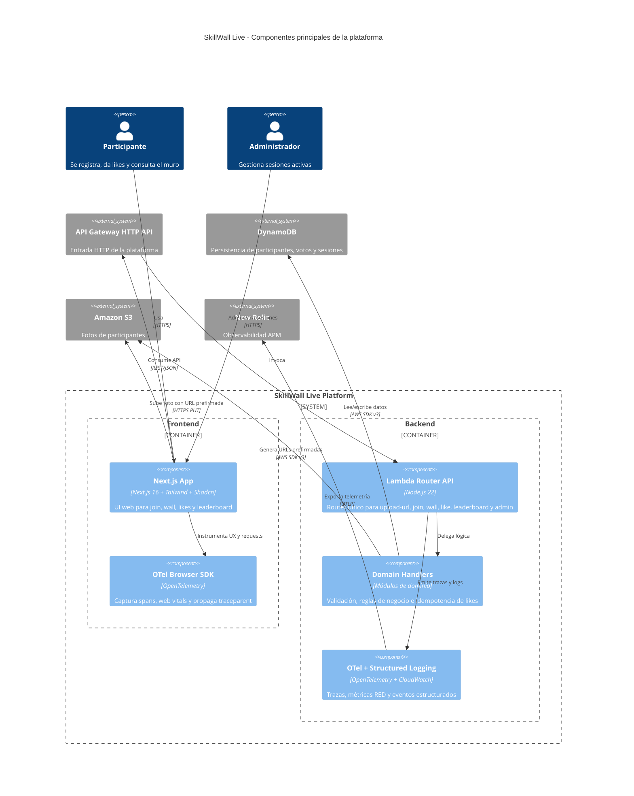

# Components — SkillWall Live

## C4 Component Diagram (Mermaid)

---

## C1: Frontend (Next.js App)

**Purpose**: SPA-like web application for participants to join, view wall, give likes, and see leaderboard.

**Responsibilities**:
- Render Join form (displayName, photo upload, skill selection)
- Upload photo to S3 via pre-signed URL
- Display Wall with participant cards (photo, name, skills, like counts)
- Display Leaderboard (top participants, top skills)
- Poll Wall and Leaderboard every ~2s
- Handle like interactions (idempotent, using participantId as voter)
- Store participantId in localStorage after join
- Initialize OTel browser SDK (auto-instrumentation, custom spans, web vitals)
- Propagate W3C traceparent on all API requests
- Apply security headers (CSP, nosniff, frame deny, referrer, permissions)

**Tech**: Next.js 16 (App Router), Tailwind, Shadcn, OTel browser SDK
**Deploy**: Vercel

---

## C2: Backend (Lambda Router)

**Purpose**: Single Lambda handling all API endpoints via internal router.

**Responsibilities**:
- Route requests to handlers: upload-url, join, wall, like, leaderboard, admin/sessions, health
- Validate all inputs (displayName, skills, sessionCode, participantId, adminToken)
- Generate S3 pre-signed URLs (write + read)
- CRUD operations on DynamoDB (participants, votes, session metadata)
- Enforce like idempotency via vote items + ConditionExpression
- Compute leaderboard from wall data (sort by totalLikes, aggregate skills)
- Emit structured logs with traceId (SESSION_CREATED, SESSION_DELETED, JOIN_CREATED, LIKE_CAST, RATE_LIMITED)
- OTel instrumentation: traces per request, RED metrics, OTLP export to New Relic

**Tech**: Node.js 22, esbuild bundling, OTel SDK, AWS SDK v3
**Deploy**: AWS Lambda (single function)

---

## C3: Infrastructure (Terraform)

**Purpose**: Declare and provision all AWS resources.

**Responsibilities**:
- API Gateway HTTP API v2 with CORS and Lambda integration
- Lambda function with IAM role (DynamoDB, S3, CloudWatch permissions)
- DynamoDB table `participants` (PK/SK, on-demand capacity)
- S3 bucket with upload restrictions
- CloudWatch log groups (Lambda logs, API Gateway access logs)
- API Gateway throttling (5 TPS per route for join/like)
- Environment variables for Lambda (adminToken, S3 bucket, DynamoDB table, New Relic key, CORS origin)
- Terraform variables for environment (dev/demo/prod)

**Tech**: Terraform, HCL
**Deploy**: terraform apply

---

## C4: Deploy Scripts

**Purpose**: Fast Lambda code deployment without full terraform apply.

**Responsibilities**:
- Build backend with esbuild
- Zip artifact
- Update Lambda function code via AWS CLI

**Tech**: Bash, AWS CLI, esbuild
