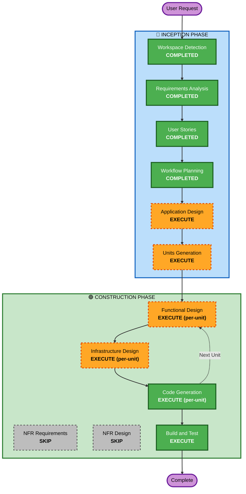

# Execution Plan — SkillWall Live

## Detailed Analysis Summary

### Change Impact Assessment
- **User-facing changes**: Yes — nueva aplicación completa con 3 vistas (Join, Wall/Leaderboard, Admin API)
- **Structural changes**: Yes — sistema greenfield con frontend, backend, infraestructura
- **Data model changes**: Yes — DynamoDB schema definido en ADR-006
- **API changes**: Yes — 8 endpoints nuevos
- **NFR impact**: Yes — OTel E2E, seguridad, rate limiting, performance

### Risk Assessment
- **Risk Level**: Medium — stack bien definido por ADRs, pero múltiples componentes integrados
- **Rollback Complexity**: Easy — greenfield, no hay sistema existente
- **Testing Complexity**: Moderate — E2E cross-service (Vercel→API GW→Lambda→DynamoDB→S3)

---

## Workflow Visualization



### Text Alternative
```
Phase 1: INCEPTION
  - Workspace Detection (COMPLETED)
  - Requirements Analysis (COMPLETED)
  - User Stories (COMPLETED)
  - Workflow Planning (COMPLETED)
  - Application Design (EXECUTE)
  - Units Generation (EXECUTE)

Phase 2: CONSTRUCTION (per-unit loop)
  - Functional Design (EXECUTE, per-unit)
  - NFR Requirements (SKIP)
  - NFR Design (SKIP)
  - Infrastructure Design (EXECUTE, per-unit)
  - Code Generation (EXECUTE, per-unit)
  - Build and Test (EXECUTE)
```

---

## Phases to Execute

### 🔵 INCEPTION PHASE
- [x] Workspace Detection (COMPLETED)
- [x] Requirements Analysis (COMPLETED)
- [x] User Stories (COMPLETED)
- [x] Workflow Planning (COMPLETED)
- [ ] Application Design - EXECUTE
  - **Rationale**: New system with multiple components (frontend, backend, infra). Need to define component boundaries, service layer, and inter-component dependencies before decomposing into units.
- [ ] Units Generation - EXECUTE
  - **Rationale**: System has 3 distinct deployable components (frontend, backend, infra) with different tech stacks and deployment targets. Decomposition into units enables structured per-unit construction.

### 🟢 CONSTRUCTION PHASE (per-unit)
- [ ] Functional Design - EXECUTE (per-unit)
  - **Rationale**: Each unit has business logic that needs detailed design — backend has DynamoDB access patterns, router, validation; frontend has state management, polling, OTel SDK; infra has resource dependencies.
- [ ] NFR Requirements - SKIP
  - **Rationale**: NFRs are already comprehensively defined in requirements.md (NFR-01 through NFR-07) and ADRs. No additional NFR discovery needed.
- [ ] NFR Design - SKIP
  - **Rationale**: NFR patterns are already specified in ADRs (rate limiting via API GW, OTel via New Relic OTLP, security headers, etc.). Implementation details will be captured in Functional Design and Code Generation.
- [ ] Infrastructure Design - EXECUTE (per-unit)
  - **Rationale**: Infra unit needs Terraform resource mapping. Backend unit needs Lambda config, IAM policies. Frontend needs Vercel config.
- [ ] Code Generation - EXECUTE (per-unit, ALWAYS)
  - **Rationale**: Implementation of all units.
- [ ] Build and Test - EXECUTE (ALWAYS)
  - **Rationale**: Build instructions, unit tests, E2E tests, smoke tests.

---

## Proposed Units

Based on the monorepo structure (/frontend, /backend, /infra) and deployment targets:

| Unit | Scope | Deploy Target |
|---|---|---|
| **backend** | Lambda router, DynamoDB operations, S3 pre-signed URLs, OTel backend, validation | AWS Lambda |
| **infra** | Terraform: API GW, Lambda, DynamoDB, S3, IAM, CloudWatch | AWS (Terraform) |
| **frontend** | Next.js App Router, Wall/Leaderboard views, Join flow, OTel browser SDK | Vercel |

**Suggested execution order**: infra → backend → frontend (dependency chain)

---

## Success Criteria
- **Primary Goal**: Working SkillWall Live demo deployable in 30 minutes
- **Key Deliverables**: Frontend on Vercel, Backend on Lambda, Infra via Terraform, OTel E2E to New Relic
- **Quality Gates**: Unit tests pass, E2E tests pass, smoke test post-deploy succeeds, traces visible in New Relic
